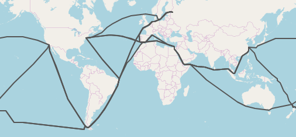

# SeaRoute

[SeaRoute](https://github.com/eurostat/searoute) computes shortest maritime routes between pairs of locations.

See below an example from [Marseille (5.3E,43.3N)](https://www.openstreetmap.org/#map=10/43.3/5.3) to [Shanghai (121.8E,31.2N)](https://www.openstreetmap.org/#map=10/31.2/121.8). The red line is the computed maritime route. The black line is the [great-circle route](https://en.wikipedia.org/wiki/Great-circle_distance).


**NEW:** It is now possible to compute maritime routes avoiding the Suez and/or Panama channel.

## Usage

### As a program

[SeaRoute](https://github.com/eurostat/searoute) requires Java 1.8 or higher. Run `java --version` to check is Java is installed and what is the current version.

Download the lastest release [here](https://github.com/eurostat/searoute/releases), unzip it and run `java -jar searoute.jar -h` to see the help which describes everything you need to know.

Examples of executions for windows users are provided in `searoute.bat` (for linux users, see `searoute.sh`). `test_input.csv` is an example of input file. It is a simple CSV file with origin/destination coordinates of the routes. Note that only geographical coordinates (decimal degrees) are supported. The output file is a [GeoJSON](https://geojson.org/) file which can be displayed on [geojson.io](http://geojson.io/) or any modern GIS software such as [QGIS](https://qgis.org).



### For Java coders

[SeaRoute](https://github.com/eurostat/searoute) is currently not deployed on a maven repository but you can quickly download, compile and install it locally with:

```
git clone https://github.com/eurostat/searoute.git
cd searoute
mvn clean install
```

and then use it in your Java project as a maven dependency:

```
<dependency>
	<groupId>eu.europa.ec.eurostat</groupId>
	<artifactId>searoute</artifactId>
	<version>1.0</version>
</dependency>
```

Here is an example of shortest maritime route computation:

```java
//create the routing object
SeaRouting sr = new SeaRouting();

//get the route between Marseille (5.3E,43.3N) and Shanghai (121.8E,31.2N)
Feature route = sr.getRoute(5.3, 43.3, 121.8, 31.2);

//compute the route distance in km
MultiLineString routeGeom = (MultiLineString) route.getGeom();
double d = GeoDistanceUtil.getLengthGeoKM(routeGeom);

//extract the route in geoJSON format
String rgj = GeoJSONUtil.toGeoJSON(routeGeom);
```

(TODO: Add link to javadoc.)

### As a webservice

To deploy [SeaRoute](https://github.com/eurostat/searoute) as a webservice (Java servlet), run:

```
git clone https://github.com/eurostat/searoute.git
cd searoute
mvn clean package
```

and move the servlet `/target/searoute.war` into your `/tomcatX.Y/webapps/` folder. Go then to http://localhost:8080/searoute/ to see the [API documentation](https://eurostat.github.io/searoute/src/main/webapp/index.html) and demos.

## Some additional information

The shortest maritime routes are computed from a network of lines covering the seas and following some of the most frequent martitime routes. This maritime network is based on the *Oak Ridge National Labs CTA Transportation Network Group, Global Shipping Lane Network, World, 2000* (retrieved from [geocommons.com](http://geocommons.com/datasets?id=25) or [github](https://github.com/geoiq/gc_data/blob/master/datasets/25.geojson)), enriched with some additional lines around the European coasts based on [AIS data](https://en.wikipedia.org/wiki/Automatic_identification_system). Simplified versions of this network have been produced for different resolutions (5km, 10km, 20km, 50km, 100km) based on a shrinking of too short edges and a removal of similar edges.

[](doc/img/marnet_overview.png)

The shortest maritime routes are computed from this network using the [Dijkstra's algorithm](https://en.wikipedia.org/wiki/Dijkstra%27s_algorithm) implemented in the wonderful [GeoTools](https://geotools.org/) library.

## Support and contribution

Feel free to [ask support](https://github.com/eurostat/searoute/issues/new), fork the project or simply star it (it's always a pleasure). If anyone feels like helping fixing the existing issues, you are welcome !
