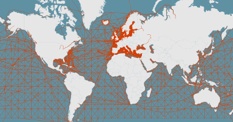

# SeaRoute

[SeaRoute](https://github.com/eurostat/searoute) is a Java library to compute shortest maritime routes between two points.

See below an example from [Marseille (5.3E,43.3N)](https://www.openstreetmap.org/#map=10/43.3/5.3) to [Shanghai (121.8E,31.2N)](https://www.openstreetmap.org/#map=10/31.2/121.8). The red line is the computed maritime route. The black line is the [great-circle route](https://en.wikipedia.org/wiki/Great-circle_distance).


## Usage

```java
//create the routing object
SeaRouting sr = new SeaRouting();

//get the route between Marseille (5.3E,43.3N) and Shanghai (121.8E,31.2N)
Feature route = sr.getRoute(5.3, 43.3, 121.8, 31.2);

//compute the distance in km
MultiLineString routeGeom = (MultiLineString) route.getGeom();
double d = GeoDistanceUtil.getLengthGeoKM(routeGeom);

//export the route in geoJSON format
String rgj = GeoJSONUtil.toGeoJSON(routeGeom);
``` 
## Installation

### For java developers

[SeaRoute](https://github.com/eurostat/searoute) is currently not deployed on a maven repository. You need to install it with:

```
git clone https://github.com/eurostat/searoute.git
cd searoute
mvn clean install
```

### As a webservice (Java servlet)

(TODO)

## Some additional information

The shortest maritime routes are computed from a network of lines covering the seas and following some of the most frequent martitime routes. The global mesh is based on the *Oak Ridge National Labs CTA Transportation Network Group, Global Shipping Lane Network, World, 2000* (retrieved from [geocommons.com](http://geocommons.com/datasets?id=25) or [github](https://github.com/geoiq/gc_data/blob/master/datasets/25.geojson)), enriched with some additional lines around the European coasts based on [AIS data](https://en.wikipedia.org/wiki/Automatic_identification_system). Simplified versions of this network have been produced for different resolutions (5km, 10km, 20km, 50km, 100km) based on a shrinking of too short edges and a removal of similar edges.

[](doc/img/marnet_overview.png)
